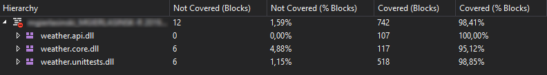

# Open Weather Xamarin client

Application written in Xamarin.Native. It can display weather information for given city from Open Weather service. Application is following MVVM pattern and was written using MvvmCross framework.

## Project structure

### Weather.Api

Communication with Open Weather API. Contains client class and DTO models. Code from this project is tested in Unit Tests.

### Weather.Core

Code shared between Android and iOS projects. Contains classes for Models and Services, as well as View Models bound to views in platform projects. DTO objects from Api are mapped to Core models and they are not used in the rest of application. Code from this project is tested in Unit Tests.

### Weather.Droid

Project for native Android application.

### Weather.iOS

Project for native iOS application.

### Weather.UITests

Project with UI tests for Android. Tests are written in Xamarin UI test framework. There are 2 main directories in the project:

- **Pages** - classes respresenting pages in application with element selectors and actions that can be performed
- **Tests** - test scenarios

### Weather.UnitTests

Unit Tests project for Api and Core. Tests are written in xUnit framework, assertions are powered by FluentAssertions. Mocking of dependencies is done with Moq, AutoFixture was used to provide test data. There are 4 main directories in the project:

- **Assertions** - extensions to Fluent Assertions
- **Concrete** - helper classes
- **TestClasses** - main directory with classes containing unit tests. Files and subdirectories should follow structure of original projects that they are testing.
- **TestData** - data for test cases, often referenced by xUnit attributes.

Code coverage measured by Visual Studio:
